# MecchaChameleon — 游戏 UI 视觉重设计需求文档

> 交付对象：Claude Design（UI/视觉设计）
> 文档版本：v1.0 · 2026-07-19
> 截图目录：`./shots/`（1080×1920 竖屏实机截图，文中逐一引用）

---

## 1. 游戏是什么（30 秒版）

**MecchaChameleon** 是一款竖屏手机 PvP 躲猫猫游戏（对标 Steam 热门游戏 MECCHA CHAMELEON）：
一局 9~10 人进入地图，随机一人当**猎人**（霰弹枪），其余是**躲藏者**——纯白色的方块小人。
躲藏阶段里，躲藏者在地图里跑动、攀爬、摆姿势，并**用画笔给自己涂色**，把自己伪装成地面
的瓷砖、墙上的涂鸦、雕像群里的一员。搜索阶段猎人来抓，被打中的人**加入猎人队**（感染制）。
核心乐趣 = "把自己涂成场景的一部分，在猎人眼皮底下装死物"。

**视觉基调**：明快、玩具感、油漆/彩虹主题（加载屏就是一支滚筒刷拖出彩虹进度条）。
UI 需要传达"欢乐派对游戏"的气质，同时在猎人视角有一点点紧张感（红色系）。

## 2. 硬性技术约束（设计前必读）

| 约束 | 说明 |
|---|---|
| **竖屏 1080×1920** | 参考分辨率，CanvasScaler 按此缩放；设计稿请按 1080×1920 出 |
| **全部 UI 由代码运行时生成** | 没有任何 UI prefab/场景 UI。设计交付需要是**可参数化的样式规范**（颜色、圆角、描边、字号、间距、九宫格切图），而不是整屏合层图 |
| **字体现状 = LegacyRuntime.ttf** | 仅内置字体；**所有 UI 文案必须是 ASCII 字符**（设备上非 ASCII 会显示豆腐块）。设计如引入新字体，需给出可免费商用的字体文件，并保持 ASCII-only 文案 |
| **图片素材现状 = 0** | 目前全部是纯色块 + 内置 UISprite。设计可以引入 PNG 图集/九宫格/图标，我们会接入；每张切图请给命名 + 尺寸 + 九宫格边距 |
| **触控目标** | 手机竖屏单手/双手拇指操作；主要按钮直径 ≥ 96px（@1080 宽），左下=移动摇杆区，右下=动作按钮群 |
| **手势规则（UiGuard）** | 落点在 UI 上的手势归 UI，落在自己身体上的归画笔，其余归摄像机——按钮不能有大面积透明热区，会吃掉摄像机手势 |
| **性能** | 移动端 URP；避免全屏级半透明大面积叠加（加载屏这类短时全屏除外）、避免每帧重建的复杂布局 |

## 3. 玩家一局的完整流程（UI 状态机）

```
LOBBY（匹配大厅）→ TRAVEL（读条进图）→ HIDE（躲藏倒计时）→ SEEK（猎人搜索）→ RESULT（结算）
```

每个阶段的 UI 详见 §4 清单。角色分两种视角：
- **躲藏者**：全程第三人称 + 涂色模式（特写自己身体）
- **猎人**：大厅第三人称（看着自己变红拿枪）→ SEEK/RESULT 第一人称 + 准星

## 4. UI 清单（逐屏逐元素，附现状截图）

说明：以下每个元素都给出精确的当前实现值（文案、字号、RGBA 颜色、锚点/位置/尺寸、交互、
代码位置），设计时**功能与信息不增不删**，只重排/重绘。所有 Canvas 都是
ScaleWithScreenSize / 参考分辨率 1080×1920 / match 0.5。层级（sortingOrder）：
`Controls`(40) < `PaintMode`(55) < `MatchHUD`(60) < `LoadingCanvas`(90)。

### 4.1 LOBBY 匹配大厅

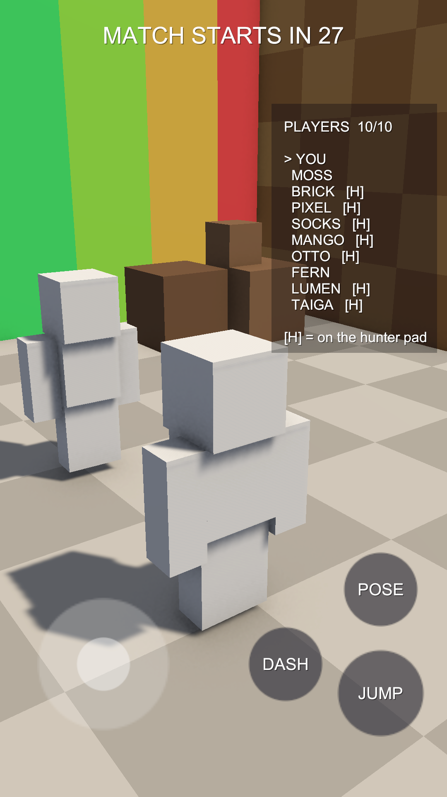

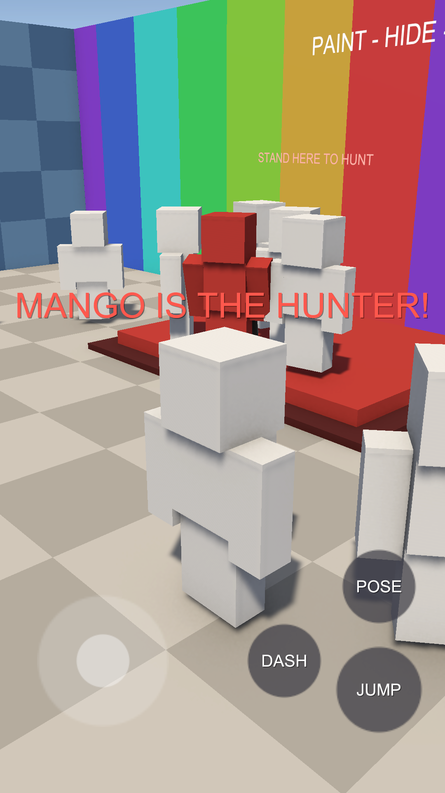

| 元素 | 类型 | 现状 | 位置/尺寸 | 代码 |
|---|---|---|---|---|
| 标题 `_title` | Text | 56 号白字+阴影，顶部居中横条。文案依次：`WAITING FOR PLAYERS...` → `WAITING FOR PLAYERS  N/7` → `ROOM FULL!` → `MATCH STARTS IN s` | 顶部全宽，anchoredPos (0,-40)，高 90 | MatchManager.cs:693, 119-133 |
| 中央横幅 `_banner`（猎人轮盘） | Text | 84 号白字，屏幕中央偏上。轮盘快速翻名字（0.055s 起步 ×1.22 减速），选中者红色 (1,0.35,0.3) 定格 0.6s → `YOU ARE THE HUNTER!` / `<NAME> IS THE HUNTER!` 停 1.5s | 中央，(0,220)，160 高 | MatchManager.cs:707, 141-174 |
| 大厅名单面板 `_rosterPanel` | Image 面板 | 深色半透明 (0.05,0.05,0.08,0.55)，右上角。内部 34 号白字：`PLAYERS N/7` 头 + 每人一行（`> YOU` / 两空格+名字，志愿者行尾 `[H]`）+ 脚注 `[H] = on the hunter pad` | 右上 (−24,−250)，400×468（7 人时） | MatchManager.cs:711-717, 671-684 |
| 猎人志愿方式 | 世界内 | **没有按钮**——走上大厅北墙的红色地台（Roblox 风格），地台上方有世界空间 TextMesh `STAND HERE TO HUNT` | 场景内 | LobbyRoom.cs |

Bot 名字池（全大写 ASCII）：MOSS, BRICK, PIXEL, SOCKS, MANGO, OTTO, FERN, LUMEN, TAIGA, PLANK, CINDER, DOT。
大厅阶段**没有**右下动作按钮群（`_actionRoot` 隐藏），TAUNT/DECOY/EYE 也全部隐藏。

**设计要点**：名单要有"匹配中"的期待感（加入动画、头像占位、志愿者徽章代替 `[H]` 文字）；
轮盘定格"谁是猎人"是全局最大的情绪节拍，值得一个完整的定版画面。

### 4.2 TRAVEL 读条进图（LoadingScreen）

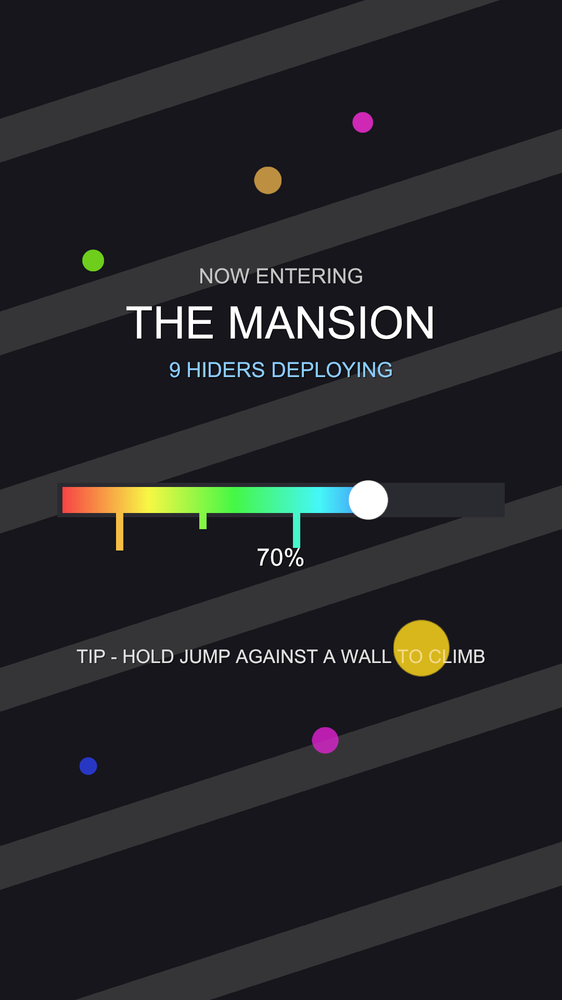

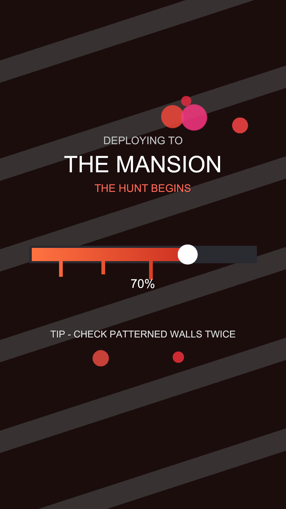

全屏不透明覆盖（LoadingCanvas 90），只有"本人在传送"时出现；淡入 0.18s，结束白闪+淡出。
这是现存质量最高的 UI，重设计时保留其骨架、统一其语汇到全局。

| 元素 | 现状 | 位置/尺寸 | 代码 |
|---|---|---|---|
| 背景 | 躲藏者 (0.085,0.085,0.11) / 猎人 (0.10,0.06,0.06) | 全屏 | LoadingScreen.cs:58 |
| 漂移斜纹 ×6 | 白 2.8% 透明度，Z 旋转 18°，缓慢漂移 | 2600×80/条 | :65-76 |
| 眉题 kicker | `NOW ENTERING` / 猎人 `DEPLOYING TO`，40 号，白 55% | (0,430) | :78-80 |
| 地图名 | `THE NEIGHBORHOOD` 等，86 号白字 | (0,340) | :82-83 |
| 副标题 | `N HIDERS DEPLOYING`（冰蓝 0.55,0.8,1）/ `THE HUNT BEGINS`（红 1,0.42,0.35） | (0,250) | :85-87 |
| 进度条 | 槽 (0.16,0.16,0.20) 860×66；填充 = 彩虹渐变（猎人=橙→深红渐变），滚筒刷圆头骑在前沿，走过的段落掉落油漆滴（5 处，14px 宽、长到 30-80px），四周随机彩色圆斑 pop | (0,0) 居中 | :90-133, 158-161 |
| 百分比 | `0%`→`100%`，46 号 | (0,-110) | :135 |
| 轮换提示 | `TIP - <tip>`，36 号白 75%，1.35s 一换（躲藏者 5 条 / 猎人 4 条攻略文案） | (0,-300) | :138-156 |

对面角色没有覆盖层，只有 HUD 文案：猎人等待时 `HIDERS ARE DEPLOYING...`；
躲藏者收到警告 `HUNTER INCOMING!` + 红色横幅 `GET READY`：

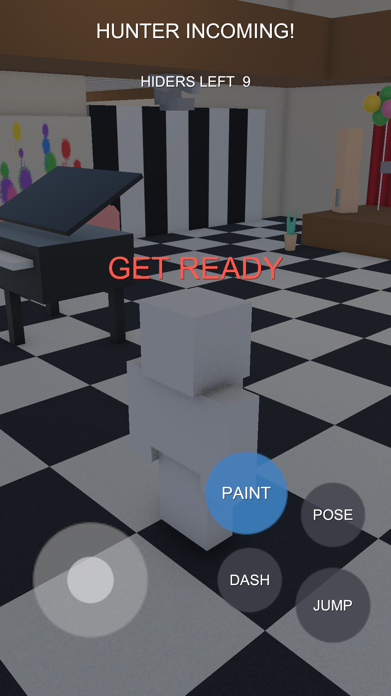

### 4.3 HIDE 躲藏阶段（躲藏者操控层）

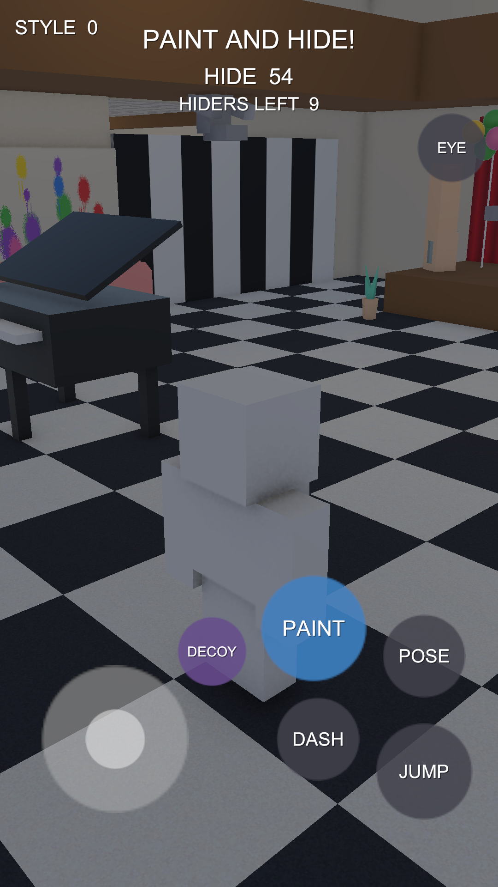

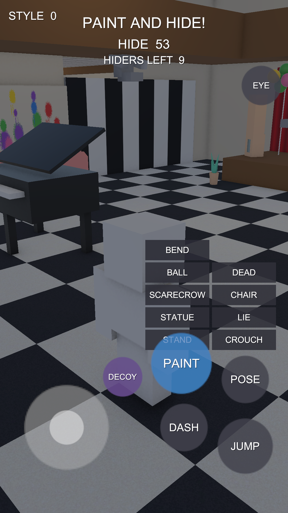

HUD 文案：`_title`=`PAINT AND HIDE!`（56 号顶部）、`_timer`=`HIDE  N` 倒计时、
`_info`=`HIDERS LEFT  N`、左上 `STYLE  0`（见 4.5）。

**左手：虚拟摇杆**——底盘 CircleSprite 白 14%，320×320 @ (250,320) 左下锚点；
拇指帽白 35%，130×130，视觉偏移 ×95px。注意：**摇杆视觉固定，但输入原点是手指落点**
（屏幕左 45% 区域内任意落指，半径=屏宽 11%）；右半屏 = 摄像机拖动。

**右手：圆形动作按钮群**（全部 CircleSprite 圆钮，深灰 (0.25,0.25,0.3,0.85) 白字）：

| 按钮 | 文案 | 位置（右下锚） | 直径 | 交互 | 代码 |
|---|---|---|---|---|---|
| 跳跃 | `JUMP` | (−160,250) | 210 | **HoldButton**：点=跳，按住=贴墙攀爬（视觉上毫无区分，是痛点#4） | PlayerRig.cs:340 |
| 冲刺 | `DASH` | (−390,320) | 180 | 点按 | :345 |
| 姿势 | `POSE` | (−160,500) | 180 | 点按开关姿势面板 | :349 |
| 情境键 | `PAINT` | (−400,560) | 230 | 蓝 (0.24,0.5,0.75,0.85)，46 号字；点按进涂色模式 | :372 |
| 分身 | `DECOY` | (−620,510) | 150 | 紫 (0.4,0.3,0.55,0.85)，30 号；一次性，用后消失 | :386 |
| 观战 | `EYE` | 右上 (−100,−320) | 150 | 见 4.5 | :392 |

**姿势选择面板 `_posePanel`**：无背景板，9 个 240×76 矩形钮（深灰 0.18,0.18,0.22,0.92，32 号白字）
两列网格 @ 右下 (−290,610)。文案 = 姿势名：`STAND / CROUCH / STATUE / LIE / SCARECROW /
CHAIR / BALL / DEAD / BEND`。点选即摆姿势并收起面板。→ 痛点#8：应改为姿势剪影图标。

### 4.4 涂色模式（SelfPaintMode）

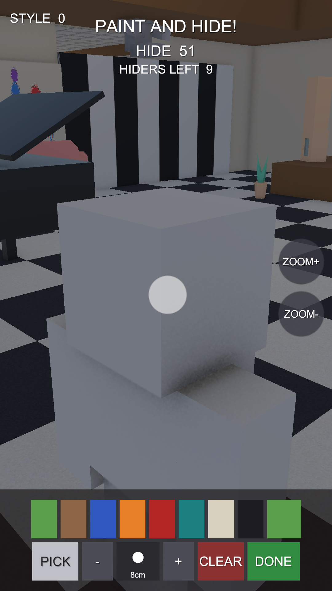

进入后操控层隐藏、身体冻结、镜头拉近到自己身上；在身体上拖动=画笔，身体外拖动=环绕镜头，
双指捏合/滚轮=推拉（0.7–2.8m），落点在 UI 上的手势全部让给 UI。

| 元素 | 现状 | 代码 |
|---|---|---|
| 笔刷光标环 | 白 45% 圆环跟随手指，直径按世界笔刷尺寸投影换算，不在身上时隐藏 | SelfPaintMode.cs:354, 317-333 |
| ZOOM+ / ZOOM− | 右缘两个 150 圆钮 (0.22,0.22,0.26,0.85)，34 号字 | :365-370 |
| 底部工具栏 | 全宽面板 (0.10,0.09,0.08,0.82) 高 330，两行布局 | :373-382 |
| 第 1 行：调色板 | 8 个 84×125 纯色块（叶绿/木棕/蓝/橙/红/青/米白/近黑）+ 110 宽当前色块 | :19-25, 387-397 |
| 第 2 行：工具 | `PICK`(150 宽，灰白底深字，开启时变黄 0.98,0.85,0.30) / `-`(100) / 尺寸盒(140，内有随笔刷 18→95px 缩放的圆点 + 26 号 `Ncm` 文字) / `+`(100) / `CLEAR`(150，暗红) / `DONE`(170，绿) | :399-429 |

→ 痛点#5 集中在此屏：色块偏小、尺寸指示弱、按钮字多图少。

### 4.5 SEEK 阶段 · 躲藏者视角

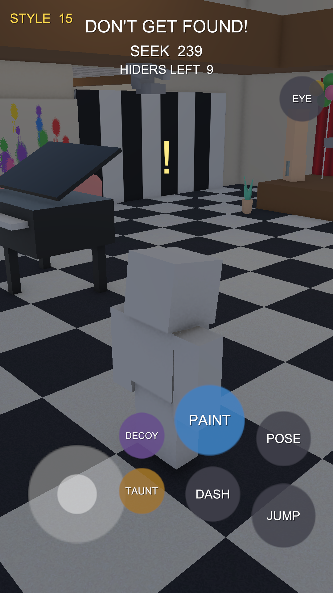

- HUD：`_title`=`DON'T GET FOUND!`、`_timer`=`SEEK  N`。
- **STYLE 分数**（左上 (32,−36)，42 号 `STYLE  N`）：站在猎人视野内每 0.5s 加分（越近越快，
  2.4→0.4/tick@14m），每次加分金色 (1,0.85,0.3) 脉冲 0.45s。这是"艺高人胆大"核心机制的
  唯一可视化，重设计时值得放大存在感（如 +N 飘字）。
- **TAUNT 按钮**：金色 (0.62,0.45,0.15,0.85) 150 圆钮 @ (−620,330)，仅 SEEK 阶段可见。
  点按=嘲讽表情+头顶世界空间 `!` 记号（金色 TextMesh，上浮 1.2s 淡出）+按与猎人距离加分，
  并惊动 18m 内的 bot 猎人。
- **DECOY 按钮**：见 4.3，一次性用后隐藏。
- **EYE 观战钮**（右上 150 圆钮）：点按=镜头切到猎人眼睛，自己冻结；按钮变红 (0.75,0.22,0.18,0.9)
  文案变 `BACK`；阶段变化自动退出。

### 4.6 SEEK 阶段 · 猎人视角（FPS）

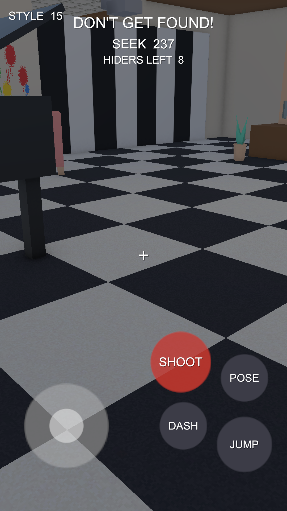

- HUD：等待期 `THE HIDERS ARE HIDING` + `SEEK IN  N`；开猎后 `FIND THEM ALL!` + `SEEK  N`。
  猎人**没有** STYLE 分数。
- **准星**：就是一个 72 号 Text `+` 居中（痛点：需要正经的 FPS 准星图形，含开火冷却反馈——
  射击冷却 1.1s 目前完全不可见）。
- **情境键**：同一个 230 圆钮，等待期灰底 `WAIT` (0.35,0.35,0.4,0.85)，开猎后红底 `SHOOT`
  (0.75,0.22,0.18,0.85)。点按从镜头向准星方向打一发霰弹（7 颗，5° 锥）。
- 命中反馈只有世界内黄色小球闪 0.25s；打中分身时中央横幅白字 `A DECOY!` 1.2s。

### 4.7 RESULT 结算屏

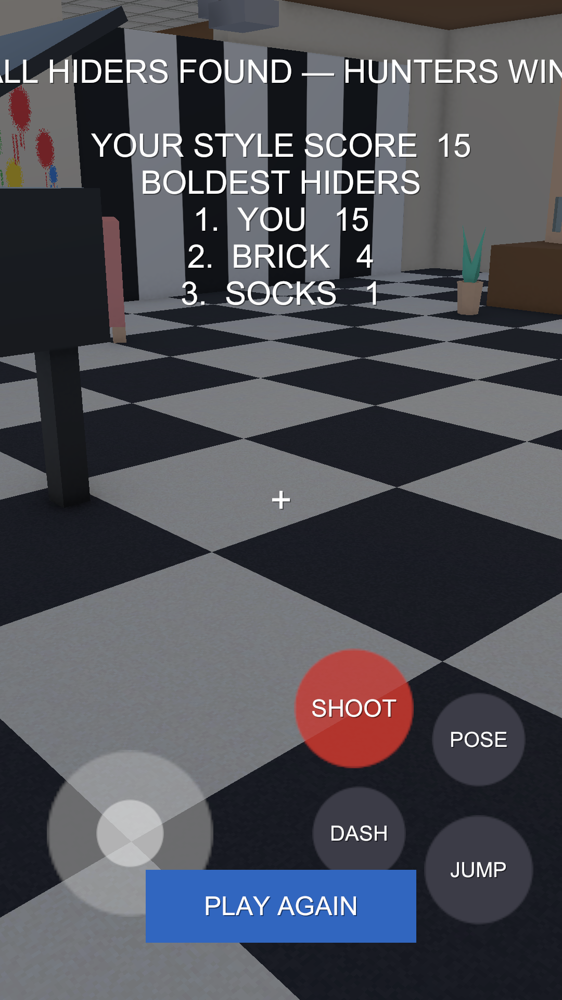

- 全屏面板（无背景图），名单/计时全部清空。
- `_resultText`：62 号白字居中 @ 顶部 (0,−260)，内容 = 胜负标题
  （`ALL HIDERS FOUND — HUNTERS WIN!` / `YOU WERE THE LAST ONE — HUNTERS WIN!` /
  `TIME'S UP — YOU SURVIVED!` / `TIME'S UP — HIDERS WIN!`）+ 空行 +
  `YOUR STYLE SCORE  N` + `BOLDEST HIDERS` 前三排行（`i.  NAME  score`）。
  ⚠ 这四条标题里的 `—` 是非 ASCII 字符（已另开修复任务，设计文案请用 `-`）。
- **PLAY AGAIN**：520×140 矩形蓝钮 (0.20,0.40,0.75)，50 号白字，底部居中 (0,110)。点按重开一局。

→ 痛点#6/#11：这是派对游戏的高光屏，需要胜负两套情绪（彩带 vs 猎人红）、排行榜卡片化;
截图 10 实证了标题溢出、无底衬、底层按钮穿透三个问题。

### 4.8 共享组件与全局规则（UiKit）

- **唯一字体**：`LegacyRuntime.ttf`（Arial 系内置），legacy uGUI Text/TextMesh，无 TMP。
- **唯一图形资源**：代码生成的 64×64 抗锯齿白色圆片 `CircleSprite`——摇杆、所有圆钮、笔刷光标、
  加载屏滚筒头/油漆滴/圆斑全部复用它。其余全是纯色矩形 Image。**没有任何导入的图片素材。**
- **MakeText 默认样式**：白字 + 投影 (0,0,0,0.7) 偏移 (2,−2)，溢出不裁剪。
- **MakeButton 默认样式**：纯色块（HUD 上 α≈0.85）+ 白字居中；round=true 用圆片。无按下反馈。
- **HoldButton**：按下即触发 `onDown` 并持续 `Held`，仅 JUMP 使用。
- **EventSystem**：InputSystemUIInputModule（新输入系统），由 `PaintUI.EnsureEventSystem` 保证。
- **触控目标现状**：圆钮 150–230px、姿势钮 240×76、色块 84×125、PLAY AGAIN 520×140、
  摇杆区=左 45% 屏。
- 旧 demo 的 `Game/PaintUI.cs` 工具栏（PaintCanvas 50 层）仍在代码里但竞技场流程不用，
  重设计**忽略它**，活的涂色 UI 是 SelfPaintMode。

## 5. 已知视觉问题（我们自己的不满，供设计参考）

按严重程度排序：

1. **零图形语言**：所有按钮都是"半透明色块 + 文字"（DASH / JUMP / POSE…），没有任何图标。
   跑动中根本来不及读字，肌肉记忆只能靠位置。→ 最想要的改进：每个动作按钮一个图标。
2. **没有视觉层级**：阶段横幅、倒计时、STYLE 分数、名单全是同一种白字，大小接近，
   玩家不知道该看哪。倒计时最后 10 秒也没有任何强调。
3. **默认字体的廉价感**：LegacyRuntime.ttf 细而灰，和游戏的"油漆玩具"气质完全不搭。
   需要一款圆润厚重的免费商用字体（ASCII 即可）。
4. **按钮状态缺失**：按下没有视觉反馈（无缩放/变色），HoldButton（按住攀爬）和普通点按
   长得一模一样，玩家不知道 JUMP 可以按住。
5. **涂色模式的工具栏拥挤**：调色板色块、PICK、笔刷大小指示、CLEAR、DONE、ZOOM 挤在
   屏幕边缘，色块小、误触率高；笔刷大小指示（一个点+cm 文字）存在感太弱。
6. **结算屏太素**：胜负标题 + 分数列表都是白字黑底，没有庆祝感（这可是派对游戏的高光时刻），
   BOLDEST HIDERS 排行榜应该是最有表演欲的地方。
7. **大厅名单缺乏"匹配中"的氛围**：右上角纯文本名单，`[H]` 标记完全看不懂含义
   （它表示"该玩家自愿当猎人"）。
8. **姿势选择面板是纯文字网格**：9 种姿势（Stand/Crouch/Statue/Lie/Scarecrow/Chair/Ball/
   Dead/Bend）用文字按钮排两列，应该用姿势剪影图标。
9. **加载屏是全场最好的 UI**（滚筒刷彩虹进度条），其余 UI 都配不上它——把它的语汇
   （滚筒、油漆滴、斜纹）扩散到全局是个现成的方向。

以下 4 条是实机截图新暴露的（见对应图）：

10. **姿势面板与 PAINT 键重叠**（`shots/06-pose-panel.png`）：面板最下排的 STAND 键被
    蓝色 PAINT 大按钮压住,基本点不到。重排时给面板留独立安全区。
11. **结算屏三连击**（`shots/10-result.png`）：胜负标题横向溢出屏幕（首尾被裁）；结算层
    没有压暗底衬,白字直接叠在场景上；底层的 SHOOT/摇杆等操控按钮仍然可见可点。
12. **中央横幅没有底板**（`shots/02-hunter-reveal.png`、`shots/11-hunter-incoming.png`）：
    红色揭晓文字叠在红色猎人地台上几乎融为一体；GET READY 同理。需要半透明底条或描边加粗。
13. **加载屏的随机圆斑会盖住 TIP 文字**（`shots/03-travel-hider.png` 黄色斑点正压在
    TIP 行上）：装饰粒子应避开文字安全区。

## 6. 设计交付物要求

请按以下清单交付，工程侧才能落地：

1. **设计 Token 表**：主色/辅色/警示色（猎人红）/文本色的十六进制值；字号阶梯（如 24/32/44/64/96）；
   间距阶梯；圆角/描边规范。给浅色文本在各底色上的对比度说明。
2. **组件规范**（每个给状态图：normal / pressed / disabled）：
   - 圆形动作按钮（DASH/JUMP/POSE/PAINT/SHOOT/EYE）——含图标方案（目前全是文字）
   - 长按型按钮（HoldButton：按住持续生效，如 JUMP=按住攀爬）视觉上如何区分
   - 面板/卡片（姿势选择面板、调色板栏、结算卡）
   - 顶部 HUD（阶段横幅、倒计时、STYLE 分数）
   - 列表条目（大厅名单行、结算排行榜行）
3. **每屏 1080×1920 视觉稿**：LOBBY、TRAVEL（彩虹版+猎人红版）、HIDE、涂色模式、SEEK（躲藏者）、
   SEEK（猎人 FPS）、RESULT——以本文档 §4 的元素清单为准，不增删功能，只重排/重绘。
4. **切图规格**：PNG（透明底），九宫格标注边距；图标 SVG 或 256px PNG；命名用 kebab-case。
5. **动效说明（可选但欢迎）**：按钮按下反馈、分数跳动、阶段横幅入场/退场，用文字+参数描述即可
   （时长/缓动/位移），工程用代码补间实现，不接 Animation 文件。

## 7. 风格方向参考

- **本体气质**：Kenney 方块小人 + 明亮低饱和场景 + 彩虹/油漆元素。UI 应该"像油漆一样"：
  色块大胆、圆角厚实、可以有油漆滴落/笔刷肌理的点缀，但信息层必须干净。
- **参考游戏**：MECCHA CHAMELEON（Steam）——它的 UI 朴素，我们想做得更精致；
  Fall Guys / Human Fall Flat 的派对感按钮与结算屏是好的气质参照。
- **猎人语汇**：红色 + 警示斜纹（加载屏已用），准星要像正经 FPS 但不失卡通。
- **禁忌**：不要写实军事风、不要赛博霓虹、不要过度磨砂玻璃（移动端性能 + 气质不符）。

---

**附：截图索引**（由 `Assets/Editor/UiShotDirector.cs` 自动生成,1080×1920,场景 = Arena06 THE MANSION；
重设计落地后可用同一工具重跑同名截图做前后对比）

| 文件 | 内容 |
|---|---|
| `shots/01-lobby.png` | LOBBY：右上名单（含 [H] 志愿标记）+ 顶部标题 |
| `shots/02-hunter-reveal.png` | 猎人揭晓横幅（轮盘定格,红字） |
| `shots/03-travel-hider.png` | 读条进图·躲藏者彩虹版（滚筒刷进度条 ~45%） |
| `shots/04-travel-hunter.png` | 读条进图·猎人红版（THE HUNT BEGINS） |
| `shots/05-hide-controls.png` | HIDE：摇杆 + DASH/JUMP/POSE/PAINT/DECOY/EYE + HUD |
| `shots/06-pose-panel.png` | 姿势选择面板（9 项两列网格） |
| `shots/07-paint-mode.png` | 涂色模式：调色板/PICK/笔刷尺寸/CLEAR/DONE/ZOOM |
| `shots/08-seek-hider.png` | SEEK 躲藏者：STYLE 分数 + TAUNT（含头顶 "!" 记号） |
| `shots/09-seek-hunter-fps.png` | SEEK 猎人 FPS：`+` 准星 + 红色 SHOOT 键 |
| `shots/10-result.png` | 结算屏:胜负标题 + STYLE 分数 + PLAY AGAIN |
| `shots/11-hunter-incoming.png` | 躲藏者视角的 HUNTER INCOMING! + GET READY 警告 |
